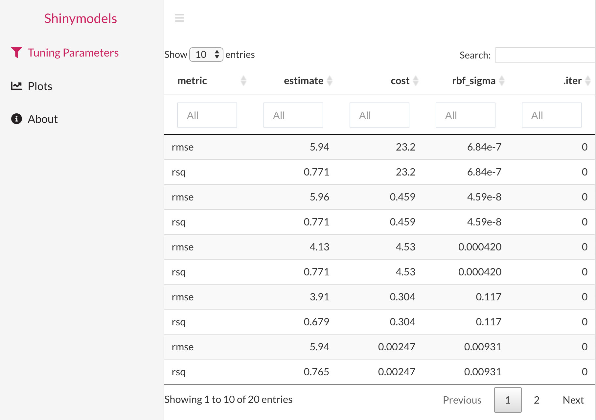

### Welcome to Shinymodels

Shinymodels is designed to help detect the problematic observations in the dataset and deal with them quickly in an efficient manner.

Let's look at a simple example. Below is the code modeling mtcars with tuning parameters using `tune::tune_bayes()`funtion.

```{r eval=FALSE}
library(tidymodels)
tidymodels_prefer()
library(doMC)
registerDoMC(cores = 8)
set.seed(6735)
folds <- vfold_cv(mtcars, v = 5)
car_rec <-
  recipe(mpg ~ ., data = mtcars) %>%
  step_normalize(all_predictors())
svm_mod <-
  svm_rbf(cost = tune(), rbf_sigma = tune()) %>%
  set_engine("kernlab") %>%
  set_mode("regression")
# Use a space-filling design with 7 points
set.seed(3254)
svm_res <- tune_bayes(svm_mod, car_rec, resamples = folds, initial = 7, iter = 3,
                     control = control_bayes(save_pred = TRUE, verbose = TRUE))
summary(svm_res)
```

Once you have the object of class `tune_`, you can use shinymodels to launch the shiny app by using the `explore()`</code>` function.
```{r eval=FALSE}
library(shinymodels)
explore(svm_res)
```

It should launch the shiny app that looks like this:


Now, you can navigate through the tabs in the sidebar to use the app and explore about the model object. Start by clicking on the tab names Tuning parameters and selecting a row. Selecting a row in the tuning parameter table selects the tuning paramter(s) and the related model. Then, in the plots tab, you should see various diagnostic plots for the model you selected. You can click on observation(s) in the plots either by clicking on individual points or using the select box to highlight the points in rest of the plots. The idea is to help see where an observation lies in different diagnostic plots and what information it gives us about the observation. This will ultimately help diagnose the outliers or "problematic" observations in the modeling objet and hopefully give insights on why that is the case. You can go between selecting different tuning paramter(s) and diagnostic plots.

