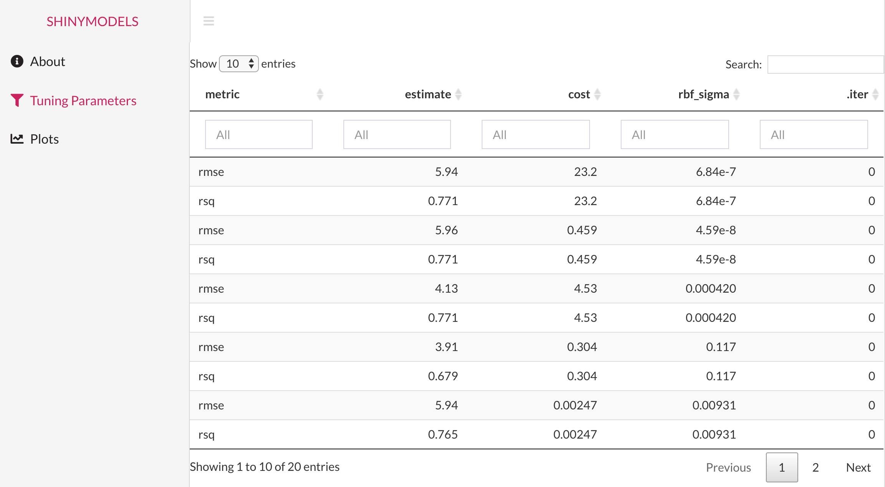

###  Welcome to Shinymodels

{shiny} + {tidymodels} = {shinymodels} 

Shinymodels app is designed to explore a {tidymodels} object. Our aim is to visualize the modeled data and help detect any problematic observations while modeling. 

### General purpose

Through various diagnostic plots, we hope to help identify structure that could otherwise go missing. Also, linking multiple graphics can lead to insight not revealed by a single view. With a model with tuning parameters, users can compare the modeling results for different selection of the parameters. Besides that, several dataset and observations information can be found and explored in this app.

### Tabs

There are mainly two categories of tabs in the app: 

* **Tuning Parameters tab:** For models with tuning parameters, like for `tune::tune_bayes()` function, the tab with tuning parameters consists of the datatable for the tuning parameters and performance metrics for each candidate model. When the app is first launched, the default configuration is based on the optimal value of the first metric. Selecting a row in the tuning parameter table selects the related model which should then update the diagnostic plots in the plots tab(s).  

* **Plots tab (s):** The Plots tab consists of diagnostic plots to explore the model object. Clicking on a particular point or selecting a group of points in any plot should highlight the point(s) in all other plots. This will help see where an observation lies in different diagnostic plots and get the insights about the observation. This will help diagnose the outliers or "problematic" observations in the modeling object and hopefully give insights on why that is the case. In the case of model with tuning parameters, the plots tab display the diagnostic plots for the selected model.

### Example
Let's look at a simple example. Below is the code modeling mtcars with tuning parameters using `tune::tune_bayes()` function.

```{r eval=FALSE}
library(tidymodels)
tidymodels_prefer()
library(doMC)
registerDoMC(cores = 8)
set.seed(6735)
folds <- vfold_cv(mtcars, v = 5)
car_rec <-
  recipe(mpg ~ ., data = mtcars) %>%
  step_normalize(all_predictors())
svm_mod <-
  svm_rbf(cost = tune(), rbf_sigma = tune()) %>%
  set_engine("kernlab") %>%
  set_mode("regression")
# Use a space-filling design with 7 points
set.seed(3254)
svm_res <- tune_bayes(svm_mod, car_rec, resamples = folds, initial = 7, iter = 3,
                     control = control_bayes(save_pred = TRUE, verbose = TRUE))
summary(svm_res)
```

Once you have the object of class `tune_`, you can use {shinymodels} to launch the shiny app by using the `explore()` function.
```{r eval=FALSE}
library(shinymodels)
explore(svm_res)
```

It should launch the shiny app that looks like this:


Now, you can navigate through the tabs in the sidebar to use the app and explore about the model object. 

### Feedback 

 This package was built by Shisham Adhikari (UC Davis) under the supervision of
 Max Kuhn (RStudio) and Julia Silge (RStudio) as a part of the RStudio summer internship 2021. Your suggestions, feedback, complaints or compliments are highly valued and will guide us to improve the package continuously. Please email them to shishamadhikari6@gmail.com or max@rstudio.com or julia.silge@rstudio.com.
 
#### For more information on Tidymodels click [here](https://www.tidymodels.org/).
